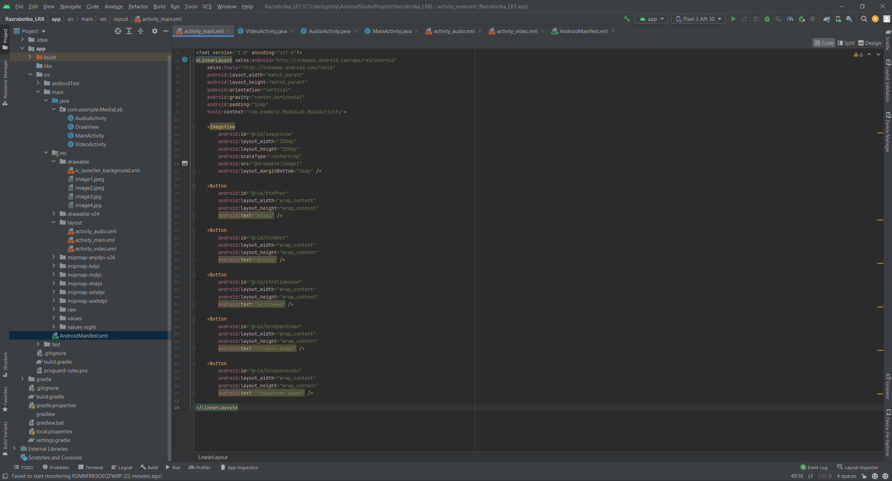
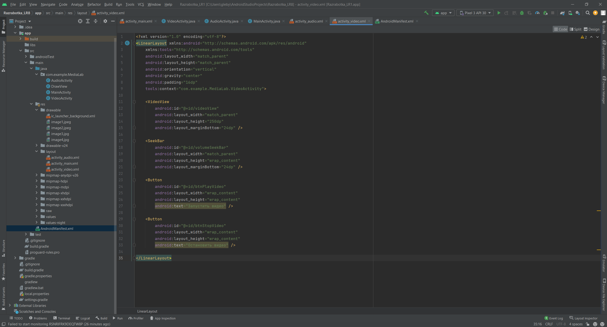
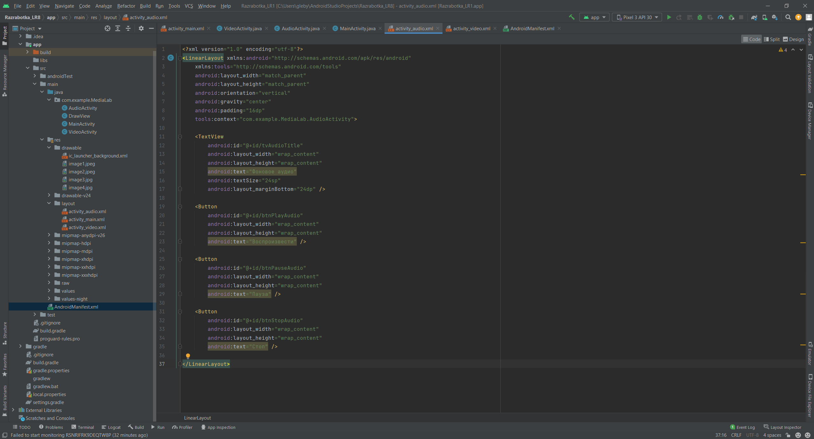
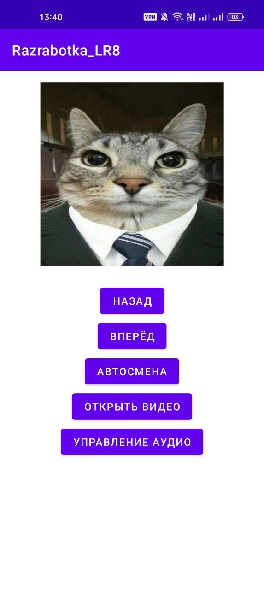
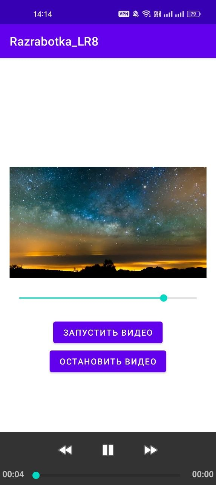
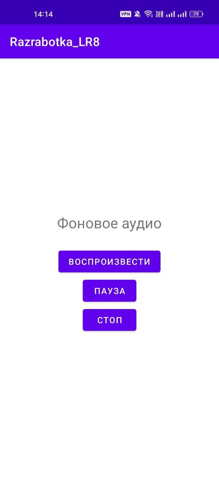

# Отчет

## Практическая работа №8

## Ресурсы. Работа с медиа-элементами

**Выполнил:**  
Ржевский Константин Романович 
**Курс:** 2  
**Группа:** ИНС-б-о-24-1

**Проверил:**   
Потапов И.Р. 

---

### Цель работы

Изучить способы добавления и отображения графических ресурсов, научиться работать с аудио- и видеофайлами в Android-приложениях, освоить управление воспроизведением медиа-контента.

### Ход работы
1. Создадим новый проект MediaLab.
Поместим 4 изображения в папку res/drawable.
Поместим короткий аудиофайл в формате MP3 в папку res/raw (audio_sample).
Поместим короткий видеофайл в формате MP4 в папку res/raw (video_sample).

2. В файле activity_main.xml создадим интерфейс с ImageView и пятью кнопками: "Назад", "Вперёд", "Автосмена", "Открыть видео", "Управление аудио".

*Рисунок 1. Настройка файла activity_main.xml*

 

В MainActivity.java реализуйем логику переключения изображений (массив ресурсов drawable). Для слайд-шоу используем Timer, меняющий изображение каждые 2 секунды.

Код MainActivity.java:

<pre>
package com.example.MediaLab;

import androidx.appcompat.app.AppCompatActivity;

import android.content.Intent;
import android.os.Bundle;
import android.widget.Button;
import android.widget.ImageView;

import com.example.razrabotka_lr1.R;

import java.util.Timer;
import java.util.TimerTask;

public class MainActivity extends AppCompatActivity {

    private ImageView imageView;

    private final int[] images = {
            R.drawable.image1,
            R.drawable.image2,
            R.drawable.image3,
            R.drawable.image4
    };

    private int currentIndex = 0;
    private Timer slideshowTimer;
    private boolean isSlideshowRunning = false;

    @Override
    protected void onCreate(Bundle savedInstanceState) {
        super.onCreate(savedInstanceState);
        setContentView(R.layout.activity_main);

        AudioActivity.initAudio(this);

        imageView = findViewById(R.id.imageView);

        Button btnPrev = findViewById(R.id.btnPrev);
        Button btnNext = findViewById(R.id.btnNext);
        Button btnSlideshow = findViewById(R.id.btnSlideshow);
        Button btnOpenVideo = findViewById(R.id.btnOpenVideo);
        Button btnOpenAudio = findViewById(R.id.btnOpenAudio);

        showImage(currentIndex);

        btnPrev.setOnClickListener(v -> showPreviousImage());
        btnNext.setOnClickListener(v -> showNextImage());
        btnSlideshow.setOnClickListener(v -> toggleSlideshow());

        btnOpenVideo.setOnClickListener(v -> {
            Intent intent = new Intent(MainActivity.this, VideoActivity.class);
            startActivity(intent);
        });

        btnOpenAudio.setOnClickListener(v -> {
            Intent intent = new Intent(MainActivity.this, AudioActivity.class);
            startActivity(intent);
        });
    }

    private void showImage(int index) {
        imageView.setImageResource(images[index]);
        currentIndex = index;
    }

    private void showNextImage() {
        currentIndex = (currentIndex + 1) % images.length;
        showImage(currentIndex);
    }

    private void showPreviousImage() {
        currentIndex = (currentIndex - 1 + images.length) % images.length;
        showImage(currentIndex);
    }

    private void toggleSlideshow() {
        if (isSlideshowRunning) {
            stopSlideshow();
        } else {
            startSlideshow();
        }
    }

    private void startSlideshow() {
        slideshowTimer = new Timer();

        slideshowTimer.schedule(new TimerTask() {
            @Override
            public void run() {
                runOnUiThread(() -> showNextImage());
            }
        }, 0, 3000);

        isSlideshowRunning = true;
    }

    private void stopSlideshow() {
        if (slideshowTimer != null) {
            slideshowTimer.cancel();
            slideshowTimer = null;
        }

        isSlideshowRunning = false;
    }

    @Override
    protected void onDestroy() {
        super.onDestroy();
        stopSlideshow();
    }
}
</pre>

3.  Создадим новую Activity VideoActivity с соответствующей разметкой activity_video.xml.
В разметку добавим VideoView, SeekBar для громкости и кнопки управления.

*Рисунок 2. Настройка файла activity_video.xml*

 

В VideoActivity.java реализуем воспроизведение видео из ресурсов и управление громкостью.

код VideoActivity.java:

<pre>
package com.example.MediaLab;

import androidx.appcompat.app.AppCompatActivity;

import android.content.Context;
import android.media.AudioManager;
import android.net.Uri;
import android.os.Bundle;
import android.widget.Button;
import android.widget.MediaController;
import android.widget.SeekBar;
import android.widget.VideoView;

import com.example.razrabotka_lr1.R;

public class VideoActivity extends AppCompatActivity {

    private VideoView videoView;
    private SeekBar volumeSeekBar;
    private AudioManager audioManager;
    private MediaController mediaController;

    private boolean videoWasStarted = false;

    @Override
    protected void onCreate(Bundle savedInstanceState) {
        super.onCreate(savedInstanceState);
        setContentView(R.layout.activity_video);

        videoView = findViewById(R.id.videoView);
        volumeSeekBar = findViewById(R.id.volumeSeekBar);

        Button btnPlayVideo = findViewById(R.id.btnPlayVideo);
        Button btnStopVideo = findViewById(R.id.btnStopVideo);

        audioManager = (AudioManager) getSystemService(Context.AUDIO_SERVICE);

        int maxVolume = audioManager.getStreamMaxVolume(AudioManager.STREAM_MUSIC);
        int currentVolume = audioManager.getStreamVolume(AudioManager.STREAM_MUSIC);

        volumeSeekBar.setMax(maxVolume);
        volumeSeekBar.setProgress(currentVolume);

        volumeSeekBar.setOnSeekBarChangeListener(new SeekBar.OnSeekBarChangeListener() {
            @Override
            public void onProgressChanged(SeekBar seekBar, int progress, boolean fromUser) {
                audioManager.setStreamVolume(AudioManager.STREAM_MUSIC, progress, 0);
            }

            @Override
            public void onStartTrackingTouch(SeekBar seekBar) {
            }

            @Override
            public void onStopTrackingTouch(SeekBar seekBar) {
            }
        });

        mediaController = new MediaController(this);
        mediaController.setAnchorView(videoView);
        videoView.setMediaController(mediaController);

        String videoPath = "android.resource://" + getPackageName() + "/" + R.raw.video_sample;
        videoView.setVideoURI(Uri.parse(videoPath));

        btnPlayVideo.setOnClickListener(v -> {
            AudioActivity.pauseAudio();
            videoView.start();
            videoWasStarted = true;
        });

        btnStopVideo.setOnClickListener(v -> {
            if (videoView.isPlaying()) {
                videoView.stopPlayback();
                videoWasStarted = false;

                videoView.setVideoURI(Uri.parse(videoPath));

                AudioActivity.resumeAudioWithDelay();
            }
        });

        videoView.setOnCompletionListener(mp -> {
            videoWasStarted = false;
            AudioActivity.resumeAudioWithDelay();
        });
    }

    @Override
    protected void onPause() {
        super.onPause();

        if (videoView != null && videoView.isPlaying()) {
            videoView.pause();
        }

        if (videoWasStarted) {
            AudioActivity.resumeAudioWithDelay();
        }
    }

    @Override
    protected void onDestroy() {
        super.onDestroy();

        if (videoView != null) {
            videoView.stopPlayback();
        }
    }
}
</pre>

4. Создадим новую Activity AudioActivity.
Реализуем воспроизведение аудиофайла из res/raw в фоновом режиме.
Также добавим логику приоритетов:
- При запуске видео (в VideoActivity) аудио должно ставиться на паузу.
- При остановке видео аудио должно возобновляться через 1.5 секунды.
- После окончания аудио оно должно начинаться заново (зацикливание).

*Рисунок 3. Настройка файла activity_audio.xml*

 

Пропишем код AudioActivity,java:

<pre>
package com.example.MediaLab;

import androidx.appcompat.app.AppCompatActivity;

import android.content.Context;
import android.media.MediaPlayer;
import android.os.Bundle;
import android.os.Handler;
import android.os.Looper;
import android.widget.Button;

import com.example.razrabotka_lr1.R;

public class AudioActivity extends AppCompatActivity {

    private static MediaPlayer mediaPlayer;
    private static Handler handler = new Handler(Looper.getMainLooper());

    @Override
    protected void onCreate(Bundle savedInstanceState) {
        super.onCreate(savedInstanceState);
        setContentView(R.layout.activity_audio);

        initAudio(this);

        Button btnPlayAudio = findViewById(R.id.btnPlayAudio);
        Button btnPauseAudio = findViewById(R.id.btnPauseAudio);
        Button btnStopAudio = findViewById(R.id.btnStopAudio);

        btnPlayAudio.setOnClickListener(v -> playAudio());
        btnPauseAudio.setOnClickListener(v -> pauseAudio());
        btnStopAudio.setOnClickListener(v -> stopAudio());
    }

    public static void initAudio(Context context) {
        if (mediaPlayer == null) {
            mediaPlayer = MediaPlayer.create(context.getApplicationContext(), R.raw.audio_sample);

            if (mediaPlayer != null) {
                mediaPlayer.setLooping(true);
                mediaPlayer.start();

                mediaPlayer.setOnCompletionListener(mp -> {
                    mp.seekTo(0);
                    mp.start();
                });
            }
        } else {
            if (!mediaPlayer.isPlaying()) {
                mediaPlayer.start();
            }
        }
    }

    public static void playAudio() {
        if (mediaPlayer != null && !mediaPlayer.isPlaying()) {
            mediaPlayer.start();
        }
    }

    public static void pauseAudio() {
        if (mediaPlayer != null && mediaPlayer.isPlaying()) {
            mediaPlayer.pause();
        }
    }

    public static void stopAudio() {
        if (mediaPlayer != null) {
            mediaPlayer.pause();
            mediaPlayer.seekTo(0);
        }
    }

    public static void resumeAudioWithDelay() {
        handler.postDelayed(() -> {
            if (mediaPlayer != null && !mediaPlayer.isPlaying()) {
                mediaPlayer.start();
            }
        }, 1500);
    }

    public static void releaseAudio() {
        if (mediaPlayer != null) {
            mediaPlayer.release();
            mediaPlayer = null;
        }
    }
}
</pre>

5. Выведем результат, запустив приложение:

*Рисунок 4. Результат приложения (главный экран)*

 

*Рисунок 5. Результат приложения (вкладка с видео)*

 

*Рисунок 5. Результат приложения (вкладка с аудио)*

 

### Вывод
В ходе практической работы были изучены способы добавления и отображения графических ресурсов в Android-приложениях, а также работа с аудио- и видеофайлами. Была реализована галерея изображений с переключением вперёд и назад, автосмена изображений, воспроизведение фонового аудио и видеоплеер со стандартными элементами управления. Также было освоено управление воспроизведением медиа-контента и регулировка громкости с помощью SeekBar.
### Ответы на контрольные вопросы
1.  **Вопрос 1: Какие типы ресурсов существуют в Android? Для чего предназначены папки drawable, raw, values?** 
В Android существуют ресурсы изображений, строк, цветов, макетов, аудио, видео и другие. Папка drawable используется для изображений и графики, raw — для аудио/видео и других файлов без обработки, values — для строк, цветов, стилей и размеров.
2.  **Вопрос 2: Как добавить изображение в приложение и отобразить его в ImageView двумя способами (из ресурсов и из файловой системы)?**
Из ресурсов изображение добавляется в drawable и выводится так: imageView.setImageResource(R.drawable.image1). Из файловой системы можно вывести через путь к файлу, например с помощью BitmapFactory.decodeFile() и imageView.setImageBitmap().
3.  **Вопрос 3: Опишите жизненный цикл MediaPlayer. Какие методы необходимо вызвать для воспроизведения аудиофайла из ресурсов?**
Жизненный цикл MediaPlayer: создание, подготовка, запуск, пауза, остановка, освобождение ресурсов. Для аудио из ресурсов обычно используют MediaPlayer.create(this, R.raw.audio_sample), затем start(), pause(), stop() и release().
4. **Вопрос 4: Для чего используется класс AudioManager? Как получить его экземпляр и изменить громкость?**
AudioManager используется для управления громкостью и аудиопотоками. Получить его можно так: AudioManager audioManager = (AudioManager) getSystemService(Context.AUDIO_SERVICE);. Громкость меняется методом setStreamVolume().
5. **Вопрос 5: Что такое VideoView и MediaController? Как их использовать для создания простого видеоплеера?** 
VideoView используется для отображения и воспроизведения видео. MediaController добавляет стандартные кнопки управления: play, pause, перемотку. Их связывают так: videoView.setMediaController(mediaController).
6. **Вопрос 6: Почему при обновлении UI (например, SeekBar) из TimerTask нужно использовать runOnUiThread()?** 
TimerTask работает в отдельном потоке, а изменять интерфейс можно только из главного UI-потока. Поэтому для обновления SeekBar, TextView или ImageView используют runOnUiThread().
7. **Вопрос 7: Как сделать, чтобы аудиофайл воспроизводился бесконечно (зацикливался)?** 
Чтобы аудиофайл воспроизводился бесконечно, нужно вызвать метод mediaPlayer.setLooping(true).
8. **Вопрос 8: Какие разрешения необходимы для доступа к медиафайлам на внешнем хранилище в разных версиях Android?** 
Для доступа к медиафайлам на внешнем хранилище нужны разрешения. В старых версиях Android использовалось READ_EXTERNAL_STORAGE, а в новых версиях Android — отдельные разрешения вроде READ_MEDIA_IMAGES, READ_MEDIA_VIDEO и READ_MEDIA_AUDIO.
